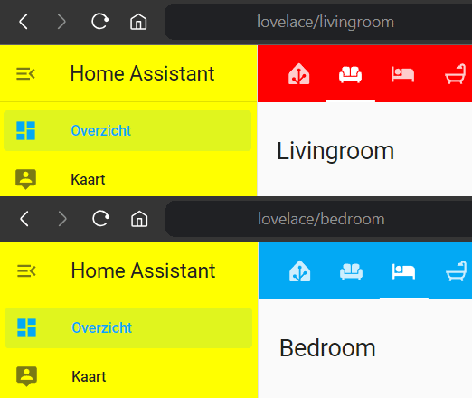

# Global mod for Home Assistant

A custom script that can mod everything in Home Assistant using local style elements. Inspired by the Thomas Lovén's [card-mod](https://github.com/thomasloven/lovelace-card-mod).

## Installing

### HACS

1. Add this repo as custom repo to HACS
2. Install this component

### Manual 

1. Copy the `global-mod.js` to your `/config/www/` directory
2. Enable advanced mode to [register resources](https://developers.home-assistant.io/docs/frontend/custom-ui/registering-resources)
3. Add `/local/global-mod.js` as a custom resource

## Usage

Modding is based on theme variables. So basically you'll need to add a special `-global-mod` theme prefixed with the name of your current theme. So for default this will be `default-global-mod`. There you can add `path`, `selector`, `style`, `style-light` and `style-dark` keys for modding. You can also easily override CSS variables within the style elements. See below for a complete example.

| Key                | Usage |
| ------------------ | ------ |
| `NAME-path`        | The URL path that is used to match on. |
| `NAME-selector`    | The DOM selector that is used to place the CSS Style element on. |
| `NAME-style`       | Your CSS style (mod) that is applied regardless of light or dark mode. |
| `NAME-style-light` | Your CSS style (mod) that is only applied in light mode. |
| `NAME-style-dark`  | Your CSS style (mod) that is only applied in dark mode. |

> [!IMPORTANT]  
> Don't use hyphens (-) in your mod name. I recommend that you use camelCase as seen below.

Shadow Root elements are identified by `$` to align with [card-mod](https://github.com/thomasloven/lovelace-card-mod) for more information check out their readme on [DOM navigation](https://github.com/thomasloven/lovelace-card-mod?tab=readme-ov-file#dom-navigation).

> [!NOTE]  
> Note that a selector of `home-assistant$` will be prefixed to all given selectors, because all styled elements are within this context.

### Example

```yaml
default-global-mod:
  yellowDrawer-path: '/'
  yellowDrawer-selector: 'home-assistant-main$ha-drawer'
  yellowDrawer-style: |
    ha-sidebar { 
      background-color: yellow; 
    }
  
  livingroom-path: 'livingroom'
  livingroom-selector: 'home-assistant-main$partial-panel-resolver ha-panel-lovelace$hui-root$div'
  livingroom-style: |
    .header { 
      --app-header-background-color: red; 
    }
```

This example will mod the default theme and
- On every page including an `/` (which are all pages) the `ha-drawer` will have a yellow background color
- On the livingroom page, the header will have a red background color


